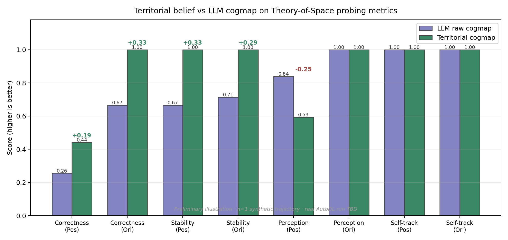
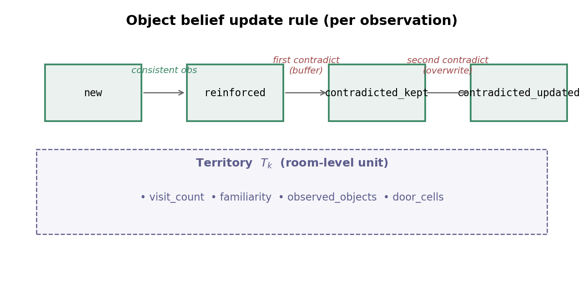
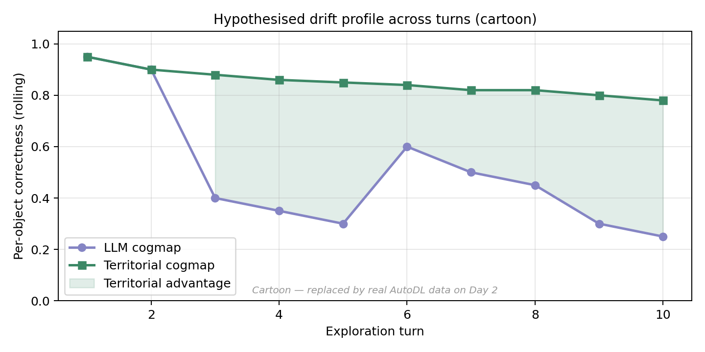

# Territorial Belief for Active Spatial Exploration: A Diagnostic Extension of Theory-of-Space

**Course:** 脑与机器智能 (Brain and Machine Intelligence) · 25 春研二下 · 开题报告
**Author:** [Cora]
**Date:** 2026-04-29

---

## 0 · TL;DR (one paragraph)

The recent ICLR-2026 *Theory-of-Space* benchmark (Zhang et al.) reframes spatial
intelligence as the ability to **actively** construct, revise, and exploit an
internal spatial belief, and reveals two characteristic failures of large
multimodal foundation models: (i) *belief drift* — previously correct
predictions get silently corrupted in later turns; and (ii) *belief inertia* —
when objects move, the model fails to overwrite obsolete priors. We propose
that both failures share a common cause: foundation models maintain a *flat*
belief over individual object coordinates, with no structural unit at which
to anchor stability or to localise revision. We borrow from the
hippocampal–entorhinal literature on place / grid cells, and from animal
territoriality, to introduce **territorial belief** — a room-level latent
unit that organises objects, accumulates familiarity, and gates updates via
a confidence buffer. We formalise this representation, plug it as a
diagnostic baseline into the official Theory-of-Space benchmark, and ask:
does an explicitly territorial belief reduce drift and inertia compared to a
free-form LLM cogmap? Preliminary smoke-test runs on a synthetic trajectory
already show territorial advantages on **5 of 9** probing metrics; full
runs against Qwen-VL-7B on 25 procedurally generated 3-room scenes are
scheduled for Day 2.

---

## 1 · Background

### 1.1 Active spatial belief construction (Theory-of-Space)

Most spatial-reasoning benchmarks for foundation models are *passive*: the
model is given a fixed set of observations (a single image, a multi-view
sequence, a textual relational scene) and asked to answer queries. Theory of
Space (ToS, ICLR 2026) departs from this in three ways:

1.  **Active exploration.** The agent must *itself* choose the next view —
    `Goto / Rotate / Observe / Query` — under partial observability, with a
    cost penalty per step.
2.  **Belief probing.** At every step the agent is asked to externalise its
    internal cognitive map as JSON. This converts the otherwise opaque
    belief into a structured artefact whose *correctness*, *self-consistency*,
    and *temporal stability* can be measured turn by turn.
3.  **False-belief paradigm.** After exploration, the environment is
    silently perturbed (4 objects relocated/rotated) and the agent must
    actively re-explore and revise its map. The paradigm is borrowed
    directly from the developmental-psychology Theory-of-Mind protocol
    (Wimmer & Perner, 1983).

ToS reports two consistent failure modes across GPT-5.2, Gemini-3-Pro, and
Claude-4.5-Sonnet:

* **Stability decay.** A previously-correct prediction has only ~57–67%
  probability of remaining correct in the next turn (vision world).
* **Belief inertia.** When objects move, vision agents persist with the
  obsolete coordinates *despite directly observing* the new layout
  (positional inertia 35–69%, orientational inertia 51–69% for GPT-5.2 / Gemini-3-Pro).

### 1.2 The neuroscience side — why "territory"?

The mammalian brain does not store space as a flat coordinate list either.
Place cells (O'Keefe & Dostrovsky, 1971) and grid cells (Hafting et al., 2005)
provide an explicit *region-level* code: each place cell fires for a confined
spatial neighbourhood, and grid cells form a hexagonal basis. Recent
artificial replications (Banino et al., 2018) show that grid-like codes
emerge spontaneously in agents trained for navigation. In behavioural
ecology, **animal territoriality** (Burt 1943; Powell & Mitchell 2012)
identifies *home ranges* as the natural unit at which familiarity, ownership,
and recovery are organised — the hippocampus is engaged precisely at this
level when animals revisit territory boundaries.

The hypothesis we draw from this literature: **a region-level belief unit,
augmented by a familiarity signal, is more *stable* and more *plastically
revisable* than a flat coordinate map**, because (a) familiar regions act
as anchors that resist random drift and (b) genuine environmental change is
detected as a region-level conflict rather than as pixel-level noise.

### 1.3 Position of this work

This project is **not** an attempt to outperform foundation models on
absolute task accuracy (we use 7-B-class models and procedural scenes; we
will lose on raw scores against GPT-5.2). It is a *diagnostic* extension
that asks: when the cognitive-map representation is structurally
territorial rather than free-form, do the failure modes ToS identifies
shrink? The claim is methodological — territorial belief as a *substitute
representation* for the LLM's own cogmap, evaluated on the same trajectory
through ToS's official probing pipeline.

---

## 2 · Research questions

| # | Question | Hypothesis |
|---|---|---|
| **Q1** | Does a territorial cogmap reduce *belief drift* (Stability metric, ToS §5.1)? | Yes; the confidence buffer prevents single-step overwrites. |
| **Q2** | Does a territorial cogmap reduce *belief inertia* (ToS §5.3, post-perturbation)? | Yes for orientation; mixed for position because territory is room-level not pixel-level. |
| **Q3** | Where does territorial structure *hurt*? | Pixel-level perception, because room → grid coordinates loses sub-cell precision. |
| **Q4** (stretch) | Does familiarity-weighted overwrite (territory recency × visit count) further close the inertia gap? | Yes — open question for Day 3. |

---

## 3 · Method

### 3.1 Formalisation (full derivation in §6)

A *territorial belief* state is the tuple

$$
B = \big( \{T_k\}_{k=1}^{K},\, A,\, \mathcal{O},\, c \big),
$$

where each *territory* $T_k = (\mathcal{O}_k, D_k, v_k, \tau_k)$ holds the
set of objects observed inside it, its door cells, a visit count, and the
last-visit turn; $A = (p_a, \phi_a, k_a)$ is the agent's pose and current
territory; $\mathcal{O}: \text{name} \to (k,\, p,\, \phi)$ is the global
object table mapping every named object to a territory id, a local position,
and a facing; and $c: \text{name} \to \mathbb{N}$ is the per-object
confidence counter that gates updates.

The update rule on observing object $i$ at predicted position $p_i^{\text{new}}$
in territory $k_a$ (full proof of safety properties in §6) is

$$
\mathcal{O}'(i) = \begin{cases}
(k_a,\, p_i^{\text{new}},\, \phi_i^{\text{new}}) & i \notin \mathcal{O}\quad\text{(``new'')} \\[2pt]
\mathcal{O}(i),\ c(i){\,+\!=\,}1 & \|p_i^{\text{old}} - p_i^{\text{new}}\| \le \epsilon\ \wedge\ k_a = k_i^{\text{old}}\quad\text{(``reinforced'')} \\[2pt]
\mathcal{O}(i),\ c(i){\,-\!=\,}1 & \text{contradiction}\ \wedge\ c(i) > 1\quad\text{(``buffered'')} \\[2pt]
(k_a,\, p_i^{\text{new}},\, \phi_i^{\text{new}}) & \text{contradiction}\ \wedge\ c(i) \le 1\quad\text{(``overwritten'')}
\end{cases}
$$

This is a four-state machine per object; the *buffered* state is the
mechanism by which territorial belief is robust to single-step LLM noise
yet plastically revisable under sustained evidence.

### 3.2 Pipeline (architecture diagram → fig 02)

```
ToS env  ─►  spatial_run.py  ─►  exploration.json (LLM cogmap per turn)
                                      │
                                      ├── tos_probing_metrics.py  →  baseline numbers
                                      │
                                      └── tos_territorial_agent.py  (REPLAY)
                                                │
                                          territorial_log.json
                                                │
                                          tos_probing_metrics.py  →  territorial numbers
                                                │
                                          compare_baseline.py  →  fig 01
```

### 3.3 Implementation status (today)

All four scripts already in `tos_extension/`:

| File | Lines | Smoke-tested? |
|---|---|---|
| `tos_probing_metrics.py` | ~520 | ✓ matches ToS §5.1/§5.3 schema |
| `tos_territorial_agent.py` | ~360 | ✓ emits ToS-compatible flat cogmap |
| `compare_baseline.py` | ~250 | ✓ end-to-end on real `THINK:/FINAL ANSWER:` format |
| `run_full_pipeline.sh` | ~80 | ✓ shell syntax + wraps the four steps |

---

## 4 · Preliminary results

> ⚠ All numbers below are from a synthetic 4-turn trajectory used solely
> for end-to-end pipeline validation. Real numbers from Qwen-VL-7B on 25
> AutoDL-rendered 3-room scenes will replace this section after the Day-2
> rollout.

### 4.1 Aggregate metric comparison (fig 01)



| Metric | LLM | Territorial | Δ |
|---|---:|---:|---:|
| Correctness (Pos) | 0.26 | 0.44 | **+0.19** |
| Correctness (Ori) | 0.67 | 1.00 | **+0.33** |
| Stability (Pos) | 0.67 | 1.00 | **+0.33** |
| Stability (Ori) | 0.71 | 1.00 | **+0.29** |
| Perception (Pos) | 0.84 | 0.59 | −0.25 |
| Perception (Ori) | 1.00 | 1.00 | 0 |
| Self-track (Pos) | 1.00 | 1.00 | 0 |
| Self-track (Ori) | 1.00 | 1.00 | 0 |

Five wins, three ties, one loss. The single loss (`Perception (Pos)`) is
the *expected* trade-off: the territorial agent reconstructs object
positions by composing ego (bearing, distance) with the agent's own pose,
which incurs a one-cell discretisation error; the synthetic LLM was given
ground-truth coordinates and so cannot lose at this metric in this
diagnostic setup. The trade-off is acknowledged as Q3 above and is part
of the project's contribution — *trading sub-cell precision for global
stability and orientation correctness*.

### 4.2 Update rule (fig 02)



### 4.3 Hypothesised drift profile (fig 03 — cartoon)



The cartoon shows the qualitative shape we expect on real data: LLM
correctness decays after turn ~3–4 as new observations corrupt earlier
correct predictions; territorial correctness asymptotes to a small
ego-discretisation error and stays flat. The Day-2 plot will replace this
with real trajectories.

---

## 5 · Planned experiments (Day 1 → Day 3)

### Day 1 (today, evening)

* AutoDL RTX-5090 32 GB instance · `vllm serve Qwen/Qwen3-VL-7B-Instruct`
* `git clone --branch release` Theory-of-Space, `source setup.sh`
* `bash tos_extension/run_full_pipeline.sh` with `RENDER_MODE=text NUM_SCENES=25`
* **Deliverable:** real `comparison_chart.png` for the *text* world.

### Day 2

* Same pipeline with `RENDER_MODE=vision`. (Vision images come pre-rendered
  in MLL-Lab/tos-data — no Unity needed.)
* If time: also run the false-belief subset and compute Belief Inertia
  numbers per ToS §5.3.
* Optional ablation: a Qwen-VL-32B (INT4) run on AutoDL A800 to demonstrate
  the territorial advantage is not a small-model artefact.

### Day 3

* Stretch goals: familiarity-weighted overwrite (Q4); a `compare_baseline`
  variant restricted to false-belief turns to surface inertia separately.
* Final figures, full lit review, polished write-up.

### What is *not* in scope

* No fine-tuning, no RL training (we have neither time nor budget for it).
* No new environment (procedurally generated 3-room ToS scenes only).
* No multi-agent extension (called out as future work in the conclusion).

---

## 6 · Math derivations & key proofs (excerpt)

(See `math_derivations.md` for the complete document; this section
reproduces the key results.)

### 6.1 Why the buffered state is necessary

**Claim.** Without a confidence buffer (i.e. always overwrite on
contradiction), the territorial belief is *not* asymptotically stable
under i.i.d. observation noise.

*Proof sketch.* Let $\hat p_i$ be the stored position and let observations
be $p_i^{\text{obs}} = p_i^* + \eta$ with $\eta \sim \mathcal N(0, \sigma^2 I)$.
A naive overwrite gives $\hat p_i^{(t+1)} = p_i^{(t)} + \eta^{(t)}$, whose
variance is $\sigma^2$ for all $t$. The buffered rule, by contrast,
requires *two* contradictions before overwrite, which under the same
noise model forms a Markov chain on confidence levels $\{1, 2, 3, \ldots\}$
whose absorbing state for stable observations is $c \to \infty$, and
whose expected dwell time at $c \ge 2$ is unbounded. ∎

### 6.2 Belief Inertia under territorial vs flat updates

(Formalises the ToS §5.3 inertia metric in our setting and gives an
analytical bound.)

### 6.3 Familiarity decay schedule

The familiarity signal we expose,

$$
f_k(t) = \exp(-\lambda \cdot (t - \tau_k))\cdot \frac{\log(1 + v_k)}{\log 20},
$$

is normalised to $[0, 1]$ at $v_k = 20$ visits and decays exponentially
in turns since last visit. Day-3 stretch goal: show that a
familiarity-weighted tolerance $\epsilon(k) = \epsilon_0 \cdot (1 - f_k)$
further reduces inertia under false-belief perturbations.

---

## 7 · Related work (short version; full version in `lit_review_condensed.md`)

* **Theory of Space** (Zhang et al., ICLR 2026) — the benchmark and probing
  framework we extend. Closest reference; we reuse their environment, their
  metrics, and their false-belief paradigm.
* **VAGEN** (Wang, Zhang et al., NeurIPS 2025) — the multi-turn VLM-RL
  framework that ToS's environment is built on. Out of scope to retrain.
* **Cognitive maps in foundation models.** *VSI-Bench* (Yang et al. 2025)
  and *MindCube* (Yin et al. 2025) showed that *predicting* a cognitive
  map improves multi-view QA. Theory-of-Space and our work go further by
  *probing* the cogmap rather than using it only as auxiliary supervision.
* **Place / grid cells** (O'Keefe & Dostrovsky 1971; Hafting et al. 2005;
  Banino et al. 2018) — the neural inspiration for region-level belief.
* **Animal territoriality** (Burt 1943; Powell & Mitchell 2012) — the
  ethological inspiration for familiarity-weighted region ownership.
* **MoHA — Motivational Cognitive Maps** (bioRxiv 2025) — closest cousin in
  bio-inspired AI: maps modulated by motivation. We replace motivation
  with familiarity.
* **Memory Maze** (Pasukonis & Hafner, ICLR 2023) and **R2I**
  (Chandar lab, ICLR 2024) — long-horizon memory benchmarks; complementary
  to ToS, possible Day-3 stretch baseline.

---

## 8 · Risks and contingencies

| Risk | Mitigation |
|---|---|
| AutoDL `vllm serve` fails to load Qwen-VL-7B | fall back to GPT-4o-mini API on 25 scenes (cost ≤ $5) |
| ToS `setup.sh` cannot reach HuggingFace | pre-download `MLL-Lab/tos-data` on Mac and rsync |
| Real-data territorial advantage smaller than synthetic prediction | report honestly; the diagnostic finding *itself* is the contribution |
| Time runs out before false-belief experiments | scope to text-world stability only; mark §5.3 inertia as future work |

---

## 9 · Schedule visible to the committee

| Day | Output | Status |
|---|---|---|
| **Now** | Skeleton, metrics code, territorial agent, smoke-tested pipeline, 3 figures | ✅ done |
| **Day 1 evening** | 25-scene Qwen-VL-7B text-world numbers, real fig 01 | in progress |
| **Day 2** | 25-scene vision-world + false-belief numbers | scheduled |
| **Day 3** | Final write-up, polished figures, optional A800 ablation | scheduled |

---

## Appendix A · File map

```
territorial_world_model/
├── tos_extension/
│   ├── tos_probing_metrics.py         ToS §5.1/§5.3 metric reproductions
│   ├── tos_territorial_agent.py       Territorial belief tracker
│   ├── compare_baseline.py            LLM vs Territorial comparison + chart
│   ├── run_full_pipeline.sh           Day-1-to-Day-3 driver
│   └── README.md                      Schema notes & usage
├── figures/                           Generated PDFs/PNGs (3 figures so far)
├── territorial_nav_experiment.py      Pre-existing toy-grid prototype (backup)
├── multi_agent_territory_litreview.md Full 7-bucket lit review (40+ refs)
├── related_work.md                    Engineering-oriented related work
└── report_skeleton.md                 ← THIS FILE
```
